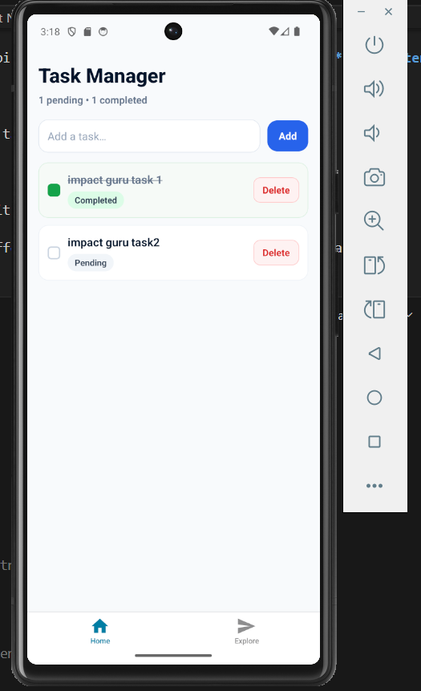

# Task Manager (React Native + Expo)

A simple and clean **Task Manager** mobile app built using **React Native** with **Expo Router**.

## Features

- **Home Screen** displaying a list of tasks
- **Task row** shows:
  - Title
  - Status (`Pending` / `Completed`)
- **Add Task** with input field + submit button (also supports keyboard submit)
- **Tap a task** to toggle `Completed`
- **Completed tasks** have a visual difference (line-through + color/background change)
- **Delete task** functionality

## Tech Stack

- React Native (Functional Components)
- React Hooks (`useState`, `useMemo`)
- Expo + Expo Router

## Getting Started

### Prerequisites

- Node.js (LTS recommended)
- Expo CLI tooling (comes via `npx`)

### Install

```bash
npm install
```

### Run

```bash
npx expo start
```

Then open using one of the options shown in the terminal:

- Android emulator
- iOS simulator
- Expo Go

## Project Structure

```text
task-manager/
  app/
    (tabs)/
      index.tsx           # Home screen (task list)
  components/
    AddTask.tsx           # Input + Add button
    TaskItem.tsx          # Task row (toggle + delete)
  screenshots/            # Screenshots used in README
```

## Screenshots

Place your screenshots inside the `screenshots/` folder and update/keep the names below.

Recommended filenames:

- `screenshots/home-empty.png`
- `screenshots/home-with-tasks.png`
- `screenshots/completed-task.png`

Preview (after you add images):

| Empty State | Task List |
| --- | --- |
|  |  |

| Completed Visual |
| --- |
|  |

## Notes

- This app uses **local state only** (no backend).
- If you want persistence, you can add AsyncStorage and save/load tasks on app start.
